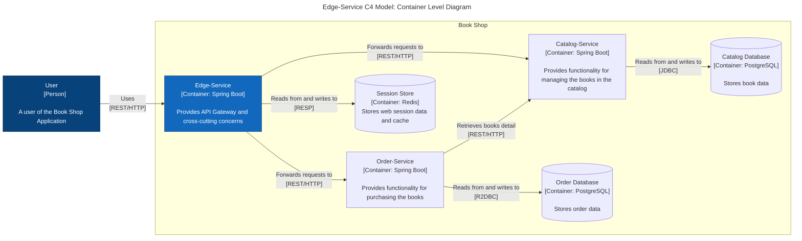

# Edge Service

Provides API Gateway and cross-cutting concerns

```mermaid
---
title: "Edge-Service C4 Model: Container Level Diagram" 
---

flowchart LR

    User["User
    [Person]

A user of the Book Shop Application"]

subgraph BS [Book Shop]

CS["Catalog-Service
[Container: Spring Boot]

Provides functionality for managing the books in the catalog"]

OS["Order-Service
[Container: Spring Boot]

Provides functionality for purchasing the books"]


ES["Edge-Service
[Container: Spring Boot]

Provides API Gateway and cross-cutting concerns"]


OD[("Order Database
[Container: PostgreSQL]

Stores order data")]

CD[("Catalog Database
[Container: PostgreSQL]

Stores book data")]

SS[("Session Store
[Container: Redis]
Stores web session data and cache")]

end

User-- "Uses\n[REST/HTTP]" -->ES
ES-- "Reads from and writes to\n[RESP]" --> SS
ES-- "Forwards requests to\n[REST/HTTP]" --> CS
ES-- "Forwards requests to\n[REST/HTTP]" --> OS
OS-- "Reads from and writes to\n[R2DBC]" -->OD
OS-- "Retrieves books detail\n[REST/HTTP]" -->CS
CS-- "Reads from and writes to\n[JDBC]" -->CD

classDef focusSystem fill:#1168bd,stroke:#0b4884,color:#ffffff
classDef person fill:#08427b,stroke:#052e56,color:#ffffff
class User person
class ES focusSystem


```

When we apply multiple resilience patterns the sequence in which they are applied is fundamental
1. Time Limitter
2. Circuit Breaker